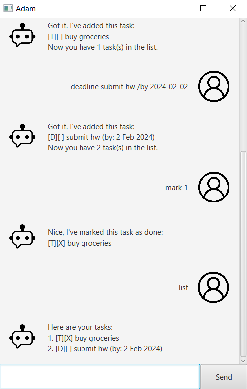

# Adam User Guide



Adam is a desktop app for **managing tasks, optimised for use via a Command Line Interface** (CLI) while still having the
benefits of a Graphical user Interface (GUI).

## Quick Start

1. Ensure you have Java 11 or above installed in your computer.
2. Download the latest adam.jar from [here](https://github.com/ibnu2651/ip/releases/download/A-Release/adam.jar).
3. Copy the file to the folder you want to use as the home folder.
4. Open a command terminal, `cd` into the folder you put the jar file in, and use the `java -jar adam.jar` command to
run the application.

## Adding todos

Adds a todo task to the list of tasks.

Format: `todo DESCRIPTION`

Example: `todo buy groceries`

Expected output:
```
Got it, I've added this task:
[T][] buy groceries
Now you have 1 task(s) in the list.
```

## Adding deadlines

Adds a deadline task to the list of tasks.

Format: `deadline DESC /by DATE`

- `DATE` must be in the format **yyyy-mm-dd**. e.g. 2024-02-02 to represent 2 February 2024

Example: `deadline submit hw /by 2024-02-02`

Expected output:
```
Got it. I've added this task:
[D][] submit hw (by: 2 Feb 2024)
Now you have 2 task(s) in the list.
```

## Adding events

Adds an event task to the list of tasks.

Format: `event DESCRIPTION /from START /to END`

- `START` and `END` can be any string

Example: `event meeting /from 4pm /to 6pm`

Expected output:
```
Got it. I've added this task:
[E][] meeting (from: 4pm to: 6pm)
Now you have 3 task(s) in the list.
```

## Listing all tasks

Shows a list of all tasks.

Format: `list`

Expected output:
```
Here are your tasks:
1. [T][] buy groceries
2. [D][] submit hw (by: 2 Feb 2024)
3. [E][] meeting (from: 4pm to: 6pm)
```

## Marking tasks as done

Marks a task as done.

Format: `mark INDEX`

- Marks the task at the specified `INDEX` as done.
- The index refers to the index number shown in the displayed list.
- The index **must be a positive integer** 1, 2, 3, ...

Example: `mark 1` marks the 1st task as done.

Expected output:
```
Nice, I've marked this task as done:
[T][X] buy groceries
```

## Marking tasks as not done

Marks a task as not done.

Format: `unmark INDEX`

- Marks the task at the specified `INDEX` as not done.
- The index refers to the index number shown in the displayed list.
- The index **must be a positive integer** 1, 2, 3, ...

Example: `unmark 1` marks the 1st task as not done.

Expected output:
```
Ok, I've marked this task as not done:
[T][] buy groceries
```

## Deleting tasks

Deletes a task from the list.

Format: `delete INDEX`

- Deletes the task at the specified `INDEX`.
- The index refers to the index number shown in the displayed list.
- The index **must be a positive integer** 1, 2, 3, ...

Example: `delete 1` deletes the 1st task in the list.

Expected output:
```
Ok, I've removed this task:
[T][] buy groceries
Now you have 2 task(s) in the list.
```

## Finding tasks

Finds the tasks that contain a certain keyword

Format: `find KEYWORD`

- The search is case-sensitive. e.g. `submit` will not match `Submit`.
- Only the description is searched.

Example: `find submit` shows a list of all tasks that contain the word 'submit' in their description.

Expected output:
```
Here are the matching tasks in your list:
[D][] submit hw (by: 2 Feb 2024)
```

## Exiting the program

Exits the program.

Format: `bye`

- Tasks are saved automatically when exiting the program.
- The program will terminate shortly after displaying the goodbye message.

Expected output:
```
Bye. Hope to see you again soon!
```